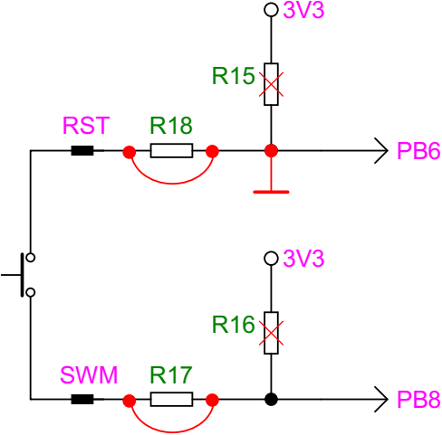

# Turning cheap Chinese ST-Link clone into security key

This repository contains necessary changes to the [original project](https://github.com/gl-sergei/u2f-token)
to turn [cheap Chinese ST-Link clone](https://stm32-base.org/boards/Debugger-STM32F103C8U6-STLINKV2) into
security key that you can use for two-factor authentication. These changes will allow you to connect the user
presence button to pin PB8 which may be better suited than the original pin PA5.

Original README file is located [here](./README.orig.md).

## Hardware modifications





## Build

Use target `ST_DONGLE_PUSH_PB8`, e.g.

```sh
make TARGET=ST_DONGLE_PUSH_PB8
```

## Flash STM32 clones with OpenOCD

Some Chinese ST-Links may contain clone of the original STM32F103 microcontroller, possibly CKS32F103C8T6.
This manifests during flashing with the following errors:

```
Warn : UNEXPECTED idcode: 0x2ba01477
Error: expected 1 of 1: 0x1ba01477
```

This can be fixed by overriding CPU ID on OpenOCD command line:

```sh
openocd -f interface/stlink-v2.cfg -c 'set CPUTAPID 0x2ba01477' -f target/stm32f1x.cfg ...
```
